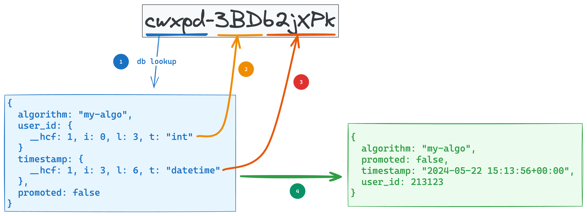

[](https://pypi.python.org/pypi/dyna-store)
[](https://pypi.python.org/pypi/dyna-store)
[](https://pypi.python.org/pypi/dyna-store)
[](https://app.codecov.io/gh/brightnetwork/dyna-store)
[](https://github.com/brightnetwork/dyna-store/actions)

# `dyna-store`

Efficient handling of high cardinality metadata.

In order to explain the main concept, let's go through an example:


## How it works



Given the id `cwxpd-3BDb2jXPk`:
1. `cwxpd` is the template id. We can use it to retrieve the template from a database.
2. the `userId` is an integer encoded in the id as `3BD` -> `213123`
3. the `timestamp` is an datetime encoded in the id as `b2jXPk` -> `2024-05-22 15:13:56+00:00`
4. the id can be fully parsed, using both the high cardinality fields (`user_id`, `timestamp`) from the id itself and the other fields (`algorithm`, `promoted`) in the template.


## Use case

We have an online shopping website, where user are shown recommended products.
Each recommendation can lead to a bunch of user events (`viewed`, `clicked`, `purchased`, etc.). These events are stored in a database for further analysis.
For each event, we want to be able to relate it to the recommendation that led to it - in particular when the recommendation was made, with which algorithm, etc.

### Without dyna-store

An approach would be to store all the recommendations in a database table:

| id | userId | timestamp | algorithm |
| --- | --- | --- | --- |
| BShivYLGif | user1 | 1716384775942 | algo-1 |
| 5SvIjZIXMm | user1 | 1716384793233 | algo-2 |
| DkBoUmvMs0 | user2 | 1716384489455 | algo-2 |
| Nm8NabCct8 | user2 | 1716384483847 | algo-2 |
| 5ZO053OGpX | user2 | 1716384448985 | algo-2 |

Each recommendation would have a unique identifier (the primary key), maybe generated by the database.

Then, we can attach to each event the recommendation id. At any point we can query the recommendation table to get the details of the recommendation.

This works, but has some limitation: the recommendation table can grow very large:
- if you are computing recommendations on the fly, a single user session can generate a lot of recommendations
- if you are pre-computing recommendations (to ensure a fast first page view), that's also a lot of data to every day.

### With dyna-store

Dyna store intend to address this limitation, by:
- store less information in the database
- store more information in the recommendation id itself

We will first split our fields between two categories:
- the low cardinality field (`algorithm` in our example) - they don't have many different values and can be stored in the database
- the high cardinality field (`userId`, `timestamp` in our example) - they have many different values and will be stored in the id.

Then in the databse we will store the low cardinality fields, as well as the information needed to parse the informations contained in the id in a new `template` table:

| id | userId | timestamp | algorithm |
| --- | --- | --- | --- |
| BShivYLGif | { __hcf: 1, i: 0, l: 5, t: "string" } | { __hcf: 1, i: 5, l: 5, t: "datetime" } | algo-1 |
| 5SvIjZIXMm | { __hcf: 1, i: 0, l: 5, t: "string" } | { __hcf: 1, i: 5, l: 5, t: "datetime" } | algo-2 |

then the recommendation id will contain two part:
- the database id of the template - `BShivYLGif`
- the high cardinality fields, b62 encoded - `user1dXed`
which will give us the recommendation id `BShivYLGif-user1dXed`

This id will be then attached to each event. From the id we can regenerate the original metadata, assuming we have access to the templates table.
In some cases, that can lead to a drastic reduction of the amount of data stored in the database.


## Usage

```python3
from datetime import datetime

from dyna_store import DynaStore, Metadata, MetadataId

# a model for your recommendations metadata
class Recommendation:
    user_id: int
    timestamp: datetime
    algorithm: str

# create a store by extending the DynaStore class
class RecommendationStore(DynaStore[Recommendation]):
    def save_metadata(self, _metadata: Metadata) -> MetadataId:
        # here you need to handle the saving of the metadata
        # could be in your database, in a file, etc.
        # you need to create and return a unique id for this metadata.
        pass

    def load_metadata(self, _id: MetadataId) -> Metadata:
        # here you need to handle the loading of the metadata from an id
        # could from your database, from a file, etc.
        pass

store = RecommendationStore(hcf=["user_id", "timestamp"])

# saving recommendations
id = store.create(Recommendation(user_id="user1", timestamp=datetime.now(), algorithm="algo-1"))
# returns a Recommendation id

# loading recommendations
store.parse(id)
# returns a Recommendation object
```


## FAQ

### What database does it support?

all. none. You need to handle the storage of the metadata yourself. It could be in a database, in a file, etc.

### What about security?

the high cardinality fields are stored in the id, so they are not encrypted. Anyone in possession of this id could:
- access the high cardinality fields values
- generate new ids with the different high cardinality fields values

This needs to be taken into account.
